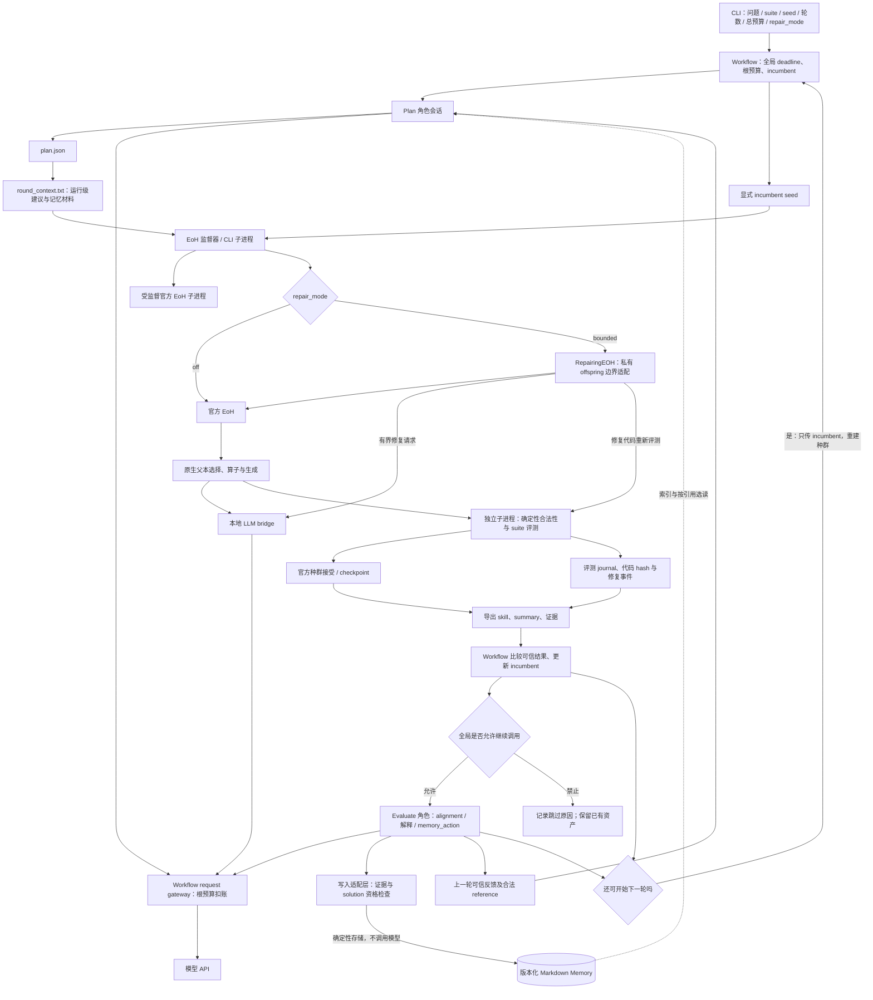
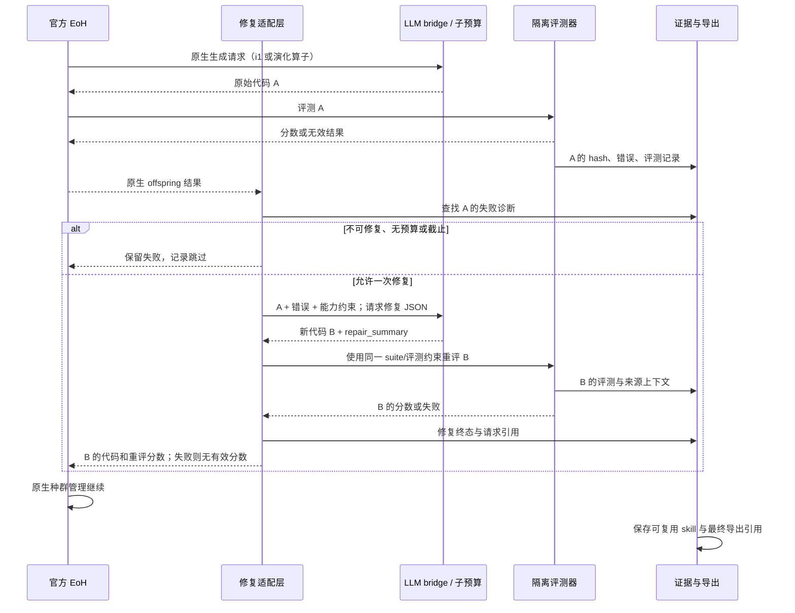
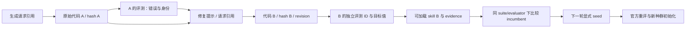

# 3+1 输入输出与实际架构链路

日期：2026-09-12。**第 1–5 节图表保留修复前架构快照，不代表当前实现。** 当前差异见本节，逐项状态与验证见 [验收报告第 0 节](acceptance.md)。

## 0. 修复后的架构差异

- 请求：真实 workflow 已统一进入父进程 OpenAIPathBridge，共享 RequestBudget；Plan、Evaluate 直接调用网关，官方 EoH 子进程通过鉴权 localhost 端点转发。`gateway/requests.jsonl` 是全局预留与终态账本，`gateway/exchanges/` 保留原始交换。子交换中的 `gateway_request_index` 对应全局编号；`request_gateway.json` 记录本轮全局区间。历史图中的“子请求事后对账”只剩离线 Execute fixture。
- 终止：网关保留 Evaluate 的额度；provider 终止、未知请求结果或全局截止后不再外发。请求取消用 killed_unknown/null tokens。监督器把进程输出写到 `eoh_process.log`，避免无人读取的管道阻塞；停止时恢复已完成评测的导出。
- 候选：bounded 模式在原生生成前绑定 candidate ID，每个 revision 预分配 evaluation ID；只接受完整身份匹配的持久化重评。终态修复事件缺失或身份冲突时隔离该条，其他可信资产继续导出。
- 响应：统一 content-only 完整输出策略，不再使用 reasoning_content；截断响应留下原文、用量和错误但不进入官方代码提取器。原生重试仍受全局预算约束。
- Memory：索引无正文，Agent 选读后才形成最终 Plan；版本 hash 校验、显式分页、读取失败降级；正文按 ref 去重、按整条舍弃到上下文预算内。`context_manifest.json` 分别记录完整上下文和实际注入正文 hash，不能把“读过”当成“已注入”。
- 发布：solution 使用实际 enriched facts，显式门槛未配置则不发布；冻结基线代码、suite/evaluator 与比较规则。Memory 8000 字符、排他写锁、基于最新版本的 CAS、完整快照合并及可恢复索引；Evaluate 决定是否写入，程序只管合同与证据。
- 解释：Evaluate 输入现在有有界实际代码、修复版本来源与差异；材料不足时 alignment=unknown。技能元数据保留 integration_mode/repair_policy_version，修复仍不意味着优化收益。

下面的图仅用于说明原始审查发现在哪些边上；不要按旧图寻找当前角色请求文件或判断共享预算是否实现。

## 1. 总体架构

说明：Execute 的生成请求就是官方 EoH 的请求，没有额外的 Execute 前置代理。Memory 是横切能力，不是第四个主流程站点。Evaluate 不决定数值接受，也不使已完成的算法资产依赖写入成功。

图中的请求网关是当前真实 workflow 的共享入口：Plan、Evaluate 和官方 EoH 子进程都通过它预留同一个根预算。全局终止后不启动新模型请求，Evaluate 可跳过；子进程结束时不再依赖事后补账。

## 2. 一次失败候选的修复链路

必须注意：修复版本必须以 candidate、revision、evaluation 和 code hash 的持久化证据闭合；无法闭合的修复记录进入隔离区，不得伪造有效分数或阻断其他可信资产导出。上图中的消息发生顺序不等于跨文件原子事务。

## 3. 输入、输出与消费方

下列路径相对运行根目录；轮目录以 `rounds/round_000N/` 表示。

| 环节 | 输入 | 输出/证据 | 后续消费 |
|---|---|---|---|
| Workflow 启动 | 问题合同、suite、初始 skill、总额度、deadline、Memory 路径、修复配置 | `workflow.json`、`role_requests.jsonl` | 各轮调度、最终审计 |
| Plan | 问题/接口、incumbent 引用、真实反馈及允许的 reference、可用记忆摘要/选读正文 | 轮目录 `plan.json`；`journal/prompts/attempt_*.txt` 与 `journal/responses/attempt_*.txt` | 上下文构造；失败原文审计 |
| 上下文 | Plan、选定版本、问题硬约束 | `round_context.txt`，相关上下文身份 | 原生生成提示；不是强制官方选择某父本 |
| EoH 初始化 | 原生配置、显式 seed、上下文 | `eoh_run/config_frozen.json`、原生运行日志/checkpoint | 原生种群与算子循环 |
| 生成/修复 API | 官方生成提示或修复 JSON 提示 | `eoh_run/results/requests.jsonl` 及原始交换记录 | 请求成本、来源追踪；不能仅按候选数计费 |
| 确定性评测 | 具体代码、problem/interface/suite、执行限制 | `eoh_run/results/evaluations.jsonl`、评测启动/完成记录 | 原生目标值、错误检测、证据导出 |
| 修复适配 | 原始失败代码与诊断、剩余预算、错误策略 | 修复事件、B 代码身份及 B 的新评测 | 返回官方 offspring；不沿用 A 的成绩 |
| 导出 | 有效评测记录、代码、修复来源 | `eoh_run/skills/candidate_N/code.py`、`skill.json`、`evidence.json`；`exported_skill/ref.json`；`summary.json` | incumbent 比较、后续 seed 与复用 |
| Evaluate | `evaluation_facts.json`、Plan、搜索摘要 | `evaluate.json` 与角色原始 I/O | 下一轮反馈、可选 Memory 决策 |
| Memory 写入 | Agent 形成的 insight/solution、版本与证据引用 | `memory_result.json`；配置目录中的版本化 Markdown 与派生索引 | 后续 Plan 选读；失败不得改写算法结果 |
| 轮结束/停止 | 真实完成状态、剩余额度、期限/错误 | `round_summary.json`、更新后的 `workflow.json` | 决定继续或终止，不伪造跳过阶段完成 |

Memory 存储目录独立配置，不假定在运行目录内。可重载代码以 skill 为准，不把 Memory 当代码库。

## 4. 身份与跨轮延续

这是应可审计的来源关系。当前实现要求每条修复版本边以 candidate、revision、evaluation 和 code hash 闭合；不得把 A 的成绩配给 B，也不得因 B 有效就宣称所有修复具有算法收益。

跨轮携带三类不同输入：incumbent 代码引用、真实反馈引用、Agent 选用的记忆版本。三者互不替代。每轮原生种群重新初始化，因此准确名称是“带计划、反馈与记忆的多轮 EoH 重启工作流”。

## 5. 对照图监控的最小指标

- 流程：各角色真实开始/完成/跳过状态，当前轮与原生初始化/演化阶段，停止原因。
- 预算：全局与子额度、实际 HTTP 请求、重试/修复分类、输入输出 tokens、finish_reason、剩余墙钟。
- 质量：原始有效率、修复后有效率、修复触发/成功/失败/跳过、baseline 与 incumbent 同口径分数。
- 证据：候选/revision/hash/evaluation/request 引用是否闭合，部分导出或身份错误数。
- Memory：检索、读取正文、实际采用、写入分别计数；记录版本、冲突与降级，不把读取等同收益。

运行结束时先核对完成轮数和停止原因，再看分数。单轮有改善或修复成功，不能替代五轮和跨轮消费验收。
