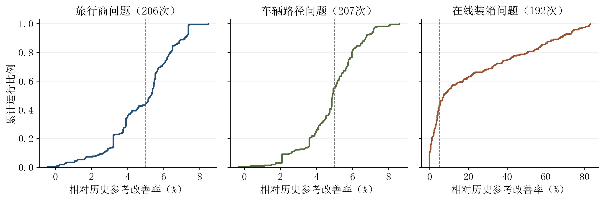
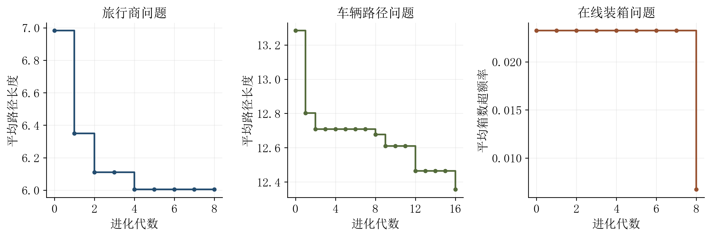

# 大语言模型驱动的多岛启发式搜索实验研究

## 605次有效运行的阶段性基准分析

## 摘要

针对组合优化中启发式规则依赖人工经验、搜索策略难以系统积累的问题，本文对一组大语言模型驱动的多岛启发式搜索实验进行统计重建与方法分析。研究对象包括旅行商问题、容量约束车辆路径问题和在线装箱问题。实验通过多个子种群并行探索、历史优良策略共享以及结构与参数变异，在固定问题实例上迭代改进构造性启发式规则。归档资料共包含631次启动记录，其中605次形成有效结果，分别为旅行商问题206次、车辆路径问题207次、在线装箱问题192次；其余26次均未形成有效的装箱初始种群。以早期实验冻结的目标值作为历史参考，三类问题的终点目标中位数分别为6.212865、12.858850和0.036875，对应相对改善率为5.29%、4.88%和7.35%；最优结果分别为6.00393、12.35639和0.00674。超过5%改善阈值的有效运行共317次，占52.40%。进一步的进化轨迹分析表明，旅行商与车辆路径问题的改善较为集中，而装箱问题表现出最优结果与典型结果差距较大的特征。数学机制分析揭示，部分名称不同的车辆路径规则具有相同的局部排序形式，装箱高质量规则则通过非单调的剩余容量偏好协调紧致装填与空间预留。鉴于各运行共享历史信息，且比较对象在模型及搜索预算方面存在差异，本文将结果定位为固定实例上的阶段性探索基准，不据此推断特定模块的独立因果贡献或对未知实例的泛化能力。本研究为后续建立统一比较条件、开展机制消融及独立验证提供了明确的参考起点。

**关键词：** 组合优化；大语言模型；自动启发式设计；多岛搜索；车辆路径；在线装箱

## 1 研究背景与研究问题

组合优化问题往往具有离散决策空间大、约束相互耦合和局部选择影响后续可行性的特点。在实际求解中，构造性启发式通过连续执行局部决策形成完整解，其优势在于规则明确、便于嵌入不同求解过程。与此同时，局部评分函数中的距离权重、容量阈值和剩余空间偏好通常依赖人工设计。即使某一规则在给定实例上表现良好，也不意味着该规则适用于其他规模或分布。

大语言模型为启发式设计提供了新的候选生成方式。已有研究将语言描述与进化搜索相结合，使启发式结构能够在评测反馈下持续变化[1]。多岛方法则将搜索分散到多个子种群，并通过有限的信息交换促进不同搜索方向之间的交流[2]。本文研究的实验将上述两种思路与历史策略检索结合，关注模型能否在三类不同的组合优化问题中形成有解释性的规则改进。

本文不把某一个事后筛选出的最优目标值作为全部实验的代表，而是围绕三个层次展开分析。首先，考察整体分布是否相对历史参考发生改善，特别是中位数、四分位数和达标比例所反映的典型表现。其次，考察同一次运行中的进化轨迹，以区分初始种群已具有的优势与后续迭代产生的改善。最后，将代表性规则还原为数学评分或选择关系，分析其决策偏好及不同规则之间的联系。

这批实验的价值在于形成了覆盖三类问题、包含完整逐代记录的历史参考集合。其研究定位是阶段性探索基准：既为后续比较提供可重复使用的问题与结果参照，也为提出更严格的实验假设提供经验依据。后文中的“改善”均指相对于明确指定的参考值或同一运行初始结果的数值下降，不自动表示统计显著性。

## 2 问题描述与评价指标

### 2.1 旅行商问题

设城市集合为 V，城市数为 n，城市 i 与 j 之间的距离为 dᵢⱼ。实验采用二维欧氏距离，要求构造经过每个城市恰好一次并返回起点的闭合路径。若排列 π 表示访问顺序，并令 π(n+1)=π(1)，则目标为

$$
\min_{\pi}\ L(\pi)=\sum_{k=1}^{n}d_{\pi(k),\pi(k+1)}.
$$

本文考虑逐点构造路径的规则。在当前城市 i、返回起点 o 和未访问城市集合 U 已知的情况下，启发式选择下一个访问城市。搜索改变的是这个局部选择规则，而不是在完整路径形成后额外执行边交换。因而，规则中即使出现长边惩罚或前瞻估价，也不能据此将其等同于完整的局部搜索算法。

旅行商实验包含8个50城市实例，各城市坐标位于单位正方形中。一个启发式的评价值是其在8个固定实例上的平均回路长度。平均长度越小，表示在该实例集合上的表现越好；该数值不是相对于已知最优解的误差。

### 2.2 容量约束车辆路径问题

设仓库为节点0，客户集合为 V，各客户需求为 qᵢ，车辆容量为 Q。所有路线均从仓库出发并返回仓库，每个客户恰好被服务一次，且单条路线服务的总需求不超过 Q。若 R 为路线集合，目标为

$$
\min_{\mathcal{R}}\ \sum_{r\in\mathcal{R}}\ \sum_{(i,j)\in r}d_{ij}.
$$

每条路线还必须满足容量约束

$$
\sum_{i\in r\setminus\{0\}}q_i\leq Q.
$$

实验采用50个客户、车辆容量40和16个固定实例。客户需求取1至9之间的整数，客户与仓库位置位于单位正方形中。局部规则在剩余容量允许的客户中选择下一服务对象，也可以决定提前返回仓库。其评价值是16个实例上的平均总行驶距离。

与旅行商问题相比，车辆路径问题的局部选择同时影响路线长度与客户分配。一项看似有利的短边选择，可能使远端客户被留给下一条路线，从而增加额外的往返距离。因此，仅凭“当前距离较短”不能充分解释规则的整体效果。

### 2.3 在线装箱问题

设物品按既定顺序到达，第 t 个物品尺寸为 aₜ，箱容量为 C。每个物品到达后必须立即分配至某个可容纳它的箱中，已作出的分配不再撤销。目标是在处理完整个序列后，使使用的箱数 B 尽可能少。本实验箱容量为100，每个实例包含5000个物品，共使用5条历史固定的 Weibull 物品流。

对第 k 条物品流，记尺寸总和为 Sₖ。体积约束给出的整数下界为

$$
L_k=\left\lceil\frac{S_k}{C}\right\rceil.
$$

该下界只考虑总体积，不保证能够被实际装箱方案达到。由于每个已用箱的容量不超过 C，任意可行方案都满足 Bₖ≥Lₖ，但一般不能据此认定 Lₖ 就是最优箱数。

实验采用平均箱数相对于平均下界的超额率，记为

$$
E=\frac{\overline{B}-\overline{L}}{\overline{L}}
 =\frac{\sum_{k=1}^{5}(B_k-L_k)}{\sum_{k=1}^{5}L_k}.
$$

该定义一般不等于五个单实例相对误差的算术平均。因此，重新比较时必须保留同一聚合口径。E 越小，表示平均使用箱数越接近体积下界，但不能直接据此推断相对于最优解的近似比。

局部评分以当前物品尺寸 a 和候选箱剩余容量 b 为输入，选择评分最高的可行箱；放置后的剩余容量记为 r=b−a。可行选择包括已有箱和可新启用的空箱。允许比较空箱意味着规则能够在“继续填充已有箱”与“为后续物品保留某种剩余空间”之间作出选择。

### 2.4 启发式搜索的统一表述

设 D 为某类问题的固定实例集合，H 为允许搜索的启发式规则集合，$F_D(h)$ 为规则 h 在 D 上的评价值。外层搜索问题可写为

$$
\min_{h\in\mathcal{H}}F_D(h).
$$

这里的决策对象是启发式规则，而不是某个实例的单个解。旅行商和车辆路径问题搜索“下一节点如何选择”，在线装箱问题搜索“可行箱如何排序”。候选规则必须先形成可评价的结果，其目标值才进入质量统计。

需要强调，固定实例上的反复优化会使 D 同时承担适应度反馈与规则选择的作用。本文因此将这些实例视为已暴露的研究实例，不将其上的最优结果表述为独立测试成绩。

## 3 实验方法与比较条件

### 3.1 多岛搜索与历史策略共享

实验设置5个采用8代搜索的岛和3个采用16代搜索的岛，名义种群规模均为6。候选生成模型为 DeepSeek V4 Flash。各岛围绕当前种群开展搜索，并可以利用共享的优良策略与历史评测信息。模型每次生成候选时获得两条检索到的策略提示，使搜索同时受到当前父代和历史经验的影响。

多岛设置的动机是容许不同子种群沿不同方向探索；共享历史则使已经出现的有效规则有机会被后续搜索利用。这一机制也使运行之间存在信息依赖。后到的运行并非与先前运行处在完全相同的知识状态，因而不能将所有终点值视为来自同一条件下的独立同分布样本。

在进化方式上，实验包含四类操作：生成与既有父代形态不同的规则；提炼多个父代的共同结构并形成新规则；对单个父代作结构修改；调整既有规则的主要数值参数。它们分别对应扩大结构探索范围、重组已有知识、改变局部机制和细化参数。实验记录支持分析这些操作共同作用下的结果，但未设置逐一移除某种操作的独立对照。

### 3.2 实验规模与有效结果

原始资料记录了631次启动，其中605次获得有效终点结果。26次未完成记录全部来自在线装箱问题，未形成有效初始种群。它们不具有可与已完成运行比较的终点目标值，因此不以任意高分、零分或缺省分数补入质量分布；同时，它们必须计入实验完成率。

**表1 实验规模与实例设置**

| 问题 | 单实例规模 | 实例数 | 启动次数 | 有效结果 | 未形成有效初始种群 |
|---|---|---:|---:|---:|---:|
| 旅行商 | 50个城市 | 8 | 206 | 206 | 0 |
| 容量约束车辆路径 | 50个客户，容量40 | 16 | 207 | 207 | 0 |
| 在线装箱 | 5000个物品，容量100 | 5 | 218 | 192 | 26 |
| 合计 | — | — | 631 | 605 | 26 |

总体完成比例为95.88%，装箱实验为88.07%。这里的完成比例描述已记录启动的结果，不是候选规则的有效率，也不是未来一次实验成功的概率估计。有效的605次运行均保留了从初始代到终止代的记录，终止代最优值与汇总结果一致。

### 3.3 历史参考值及其解释

为保持与原阶段总结一致，本文沿用三个冻结参考值：旅行商6.560、车辆路径13.519、在线装箱0.0398。这些值来自早期未使用检索增强的纯进化组的中位数，属于历史比较参照，不是三类问题的理论最优值，也不能一概称为经典人工启发式的成绩。

早期参照实验采用4代、种群规模4；当前批次采用8代或16代、种群规模6。旅行商与车辆路径的早期参照还使用了不同的候选生成模型。因此，当前结果与历史参考之间的差异混合了搜索预算、生成模型、知识供给与多岛信息共享等因素。本文只据此说明相对于历史起点的数值进展，不将差异单独归因于检索、多岛结构或大语言模型的某一能力。

对最小化目标 f 和冻结参考值 b，定义相对改善率

$$
I(f;b)=100\%\times\frac{b-f}{b}.
$$

I 为正表示目标值低于参考。文中的5%阈值严格对应 f<0.95b。历史参考经过舍入，尤其装箱参照0.0398与早期记录中的0.03984并不完全相同。因此，接近零的装箱改善率不宜解释成实质退化；本文不借助这一微小精度差异强化结论。

### 3.4 统计分析原则

统计单位是“一次有效运行的终点最优值”，不是种群中的每个候选，也不是一个问题实例。对每类问题分别报告均值、中位数、样本标准差、四分位数、最优值和改善阈值比例。标准差仅描述该批历史结果的离散程度，不换算为独立重复假设下的标准误，也不据此报告置信区间或显著性检验。

分位数采用有序样本位置上的线性插值。单次目标值继承归档记录的五位小数精度；均值、中位数和四分位数出现更多小数位，是统计计算的结果，并不意味着原始评测精度增加。对8代与16代结果，除分别描述终点分布外，还在同一条16代轨迹内比较第8代和第16代，避免完全依赖不同批次之间的横向差异。

## 4 总体结果与分布特征

### 4.1 终点目标的整体分布

**表2 605次有效运行的终点目标分布**

| 问题 | 样本数 | 最优值 | 均值 | 中位数 | 样本标准差 | 第一四分位数 | 第三四分位数 |
|---|---:|---:|---:|---:|---:|---:|---:|
| 旅行商 | 206 | 6.00393 | 6.243657 | 6.212865 | 0.116923 | 6.155078 | 6.313690 |
| 车辆路径 | 207 | 12.35639 | 12.864044 | 12.858850 | 0.204310 | 12.734370 | 12.980615 |
| 在线装箱 | 192 | 0.00674 | 0.030943 | 0.036875 | 0.010311 | 0.023698 | 0.038840 |

旅行商和车辆路径的均值与中位数较接近，说明典型结果与总体平均结果之间的差异相对有限。旅行商中间50%的结果落在6.155078至6.313690之间，车辆路径对应区间为12.734370至12.980615。两类问题的典型终点均优于历史参考，但最优结果仍好于中位数，不能将最好一次运行的改善率视作重复运行的典型水平。

在线装箱的情况不同。其均值0.030943明显低于中位数0.036875，最优值0.00674又远低于两者，说明少数较强结果对平均值具有较大影响。该分布不宜概括为“每次运行均获得约83%的改善”。更合适的描述是：典型结果的超额率有一定下降，同时搜索发现了少量远优于典型水平的规则。

### 4.2 改善比例与达标情况

**表3 相对于历史参考的改善表现**

| 问题 | 最优改善率 | 中位数改善率 | 均值改善率 | 改善超过5%的次数 | 超过5%的比例 |
|---|---:|---:|---:|---:|---:|
| 旅行商 | 8.48% | 5.29% | 4.82% | 115/206 | 55.83% |
| 车辆路径 | 8.60% | 4.88% | 4.84% | 93/207 | 44.93% |
| 在线装箱 | 83.07% | 7.35% | 22.26% | 109/192 | 56.77% |

全部有效运行中，317次超过5%阈值，占52.40%。这一合计只表示达标记录所占比例，不能把三类问题的原始目标值合并求平均，也不能把三类改善率直接当作同一经济或物理意义上的收益。

如果将26次未完成运行计入启动分母，而不为其赋予虚构目标值，则“每次启动获得超过5%改善结果”的记录比例为317/631，即50.24%；在线装箱为109/218，即50.00%。这与表3的条件比例回答不同问题：表3描述成功形成结果之后的质量分布，后者同时考虑能否形成结果。两种口径应同时保留。

图1中，横轴为相对历史参考的改善率，纵轴为不超过该改善率的运行比例。该图只展示历史样本的经验分布，不表示独立重复下的总体概率。旅行商与车辆路径的改善集中在较窄区间，而装箱问题的正向改善范围较宽，进一步说明其高质量个例与典型结果之间的差距。

### 4.3 装箱改善率的量纲解释

装箱最优改善率83.07%针对的是超额率 E，而不是所用箱数 B。对于相同实例集合和相同下界，平均箱数可写为平均下界与“1加超额率”的乘积。由参考超额率 E₀ 到新超额率 E₁ 的实际平均箱数下降比例为

$$
\frac{\overline{B}_0-\overline{B}_1}{\overline{B}_0}
=\frac{E_0-E_1}{1+E_0}.
$$

代入历史参考0.0398与最优超额率0.00674，可得对应的平均箱数下降约为3.18%。这并不削弱超额率下降的意义：当结果已接近体积下界时，进一步消除大量剩余超额仍具有研究价值。但论文必须同时说明评价指标和原始资源量的关系，不能把“超额率下降83.07%”改写为“箱数减少83.07%”。

该换算是基于同一下界和舍入后的历史参考得到的量纲说明，不替代原始逐实例箱数对照。装箱最优值仍大于零，也不能据此断言存在可行方案能够达到体积下界。

## 5 进化过程与搜索深度分析

### 5.1 同一次运行的初始结果与终点结果

为了区分初始生成和后续进化的作用，对每次运行计算其初始代最优值与终点最优值的变化。初始代指该次运行形成的初始种群，不是整个实验的无知识起点；共享历史仍可能影响初始规则。

**表4 同次运行内部的进化改善**

| 问题 | 初始最优值中位数 | 终点最优值中位数 | 终点优于初始的次数 | 该比例 | 逐运行内部改善率中位数 |
|---|---:|---:|---:|---:|---:|
| 旅行商 | 6.529850 | 6.212865 | 175/206 | 84.95% | 3.48% |
| 车辆路径 | 13.281060 | 12.858850 | 196/207 | 94.69% | 2.41% |
| 在线装箱 | 0.039840 | 0.036875 | 162/192 | 84.38% | 9.49% |

表4最后一列先计算每个运行内部的相对变化，再对这些变化取中位数，不等于前两列中位数之差除以前一列中位数。两者对应不同统计量，不能相互替代。

三类问题均有超过八成的有效运行在初始种群之后继续改善。车辆路径的改善发生比例最高，但其内部改善幅度中位数并非最大；装箱的典型内部相对变化较大，同时仍有30次运行终点与初始最优值相同。这说明“是否继续改善”和“改善了多少”需要分别讨论。

这些观察支持迭代搜索在已有运行中产生了进一步优化结果。然而，没有同预算的“一次性生成大量候选”对照，仍不能据此证明逐代进化必然比其他候选分配方式更有效。

### 5.2 三个最优运行的逐代变化

三个全批次最优结果对应的轨迹具有不同形态。旅行商最优运行从6.98316起步，第1代降至6.34985，第2代降至6.10999，第4代达到6.00470，第8代进一步达到6.00393。其主要改善发生在前几代，后续变化较小；相对于该运行自身初始值，终点下降14.02%。

车辆路径最优运行从13.28321起步，第1代达到12.80153，第2代达到12.70876，随后经历一段停滞，第8代、第9代、第12代和第16代继续改善，最终为12.35639。内部相对下降为6.98%。该个例显示较晚阶段仍可能出现改善，但不能从一个最优个例推断所有运行都应延长至16代。

装箱最优运行从第0代至第7代均保持0.02324，第8代下降至0.00674，内部相对改善为71.00%。这一轨迹表明，长时间没有最优值变化并不必然意味着后续不会出现有效结构变化；同时，事后观察到一次晚期改善，也不足以说明延长任意停滞运行都具有较高收益。

图2中的运行是依据最终结果事后选出的，适用于展示搜索过程的可能形态，不代表随机选择一次运行时的期望表现。初始值与终点值的变化由完整轨迹给出，不把停滞期解释成模型未进行任何有效探索。

### 5.3 八代与十六代结果的描述性比较

**表5 不同搜索深度的终点结果**

| 问题 | 代数 | 有效运行数 | 终点中位数 | 最优值 | 改善超过5%的次数 |
|---|---:|---:|---:|---:|---:|
| 旅行商 | 8 | 184 | 6.221555 | 6.00393 | 99 |
| 旅行商 | 16 | 22 | 6.183970 | 6.08075 | 16 |
| 车辆路径 | 8 | 183 | 12.860650 | 12.42319 | 77 |
| 车辆路径 | 16 | 24 | 12.774385 | 12.35639 | 16 |
| 在线装箱 | 8 | 172 | 0.037180 | 0.00674 | 93 |
| 在线装箱 | 16 | 20 | 0.029080 | 0.00694 | 16 |

三类问题的16代组中位数均低于8代组，其中装箱差异较大。但组间运行数明显不均衡，且各岛使用的共享历史与启动时刻并不相同。因此，表5不能被解释为仅增加代数所产生的因果效果。

旅行商和装箱的全批次最优值反而来自8代组，这与16代组中位数较低并不矛盾。一方面，最优值与中位数反映不同性质；另一方面，8代组包含更多运行，拥有更多发现极端好结果的机会。比较组间最优值时必须同时考虑尝试次数，不能仅凭最优值决定搜索深度。

### 5.4 同一十六代轨迹中的后半程收益

为进一步减少不同初始条件的干扰，考察每条16代轨迹在第8代之后是否继续改善。

**表6 同一运行第8代至第16代的变化**

| 问题 | 轨迹数 | 后半程继续改善 | 第8代目标中位数 | 第16代目标中位数 | 逐运行后半程改善率中位数 |
|---|---:|---:|---:|---:|---:|
| 旅行商 | 22 | 11 | 6.218950 | 6.183970 | 0.01% |
| 车辆路径 | 24 | 17 | 12.854575 | 12.774385 | 0.65% |
| 在线装箱 | 20 | 12 | 0.037630 | 0.029080 | 6.23% |

相对于表5，这一比较的两个端点来自同一条运行轨迹，避免了直接比较两个不同运行的初始种群。但后半程仍增加了搜索资源，而且共享历史可能继续变化，故它识别的是“这些已发生的续搜轨迹增加了多少改善”，不是单位成本效率，更不是独立重复下的普遍规律。

装箱的后半程改善中位数高于另外两类问题，提示较长搜索可能更有机会调整其非单调评分结构。旅行商后半程的逐运行改善率中位数约为0.01%，则表明相当部分续搜已接近该次运行的停滞阶段。该现象可作为后续设计停止规则的线索，但不能直接用本批最优轨迹反向制定并检验同一停止规则。

## 6 代表性规则的数学机制分析

### 6.1 代表性结果及其选择边界

从每类问题中保留三个便于比较的较优规则，共九个代表。代表的用途是展示决策机制，而不是替代全部605次运行。选择同时考虑结果质量和数学表达上的差异；对于名称不同但排序相同的规则，下文明确说明其关系，不把命名差异当作机制独立性。

**表7 九个代表性规则**

| 问题 | 编号 | 主要决策形式 | 目标值 | 相对历史参考改善 |
|---|---|---|---:|---:|
| 旅行商 | T1 | 剩余路径前瞻与动态距离权重 | 6.00393 | 8.48% |
| 旅行商 | T2 | 起点距离比例与局部连接距离 | 6.07352 | 7.42% |
| 旅行商 | T3 | 当前距离减去起点距离奖励 | 6.07672 | 7.37% |
| 车辆路径 | C1 | 最远客户开线与容量触发的节约准则 | 12.35639 | 8.60% |
| 车辆路径 | C2 | 节约型客户排序与另一回仓条件 | 12.42319 | 8.11% |
| 车辆路径 | C3 | 随剩余容量变化的距离组合 | 12.43290 | 8.03% |
| 在线装箱 | B1 | 利用率奖励与分段残差惩罚 | 0.00674 | 83.07% |
| 在线装箱 | B2 | 残差幂次倒数与半箱偏离惩罚 | 0.00694 | 82.56% |
| 在线装箱 | B3 | 残差倒数与相对剩余容量峰值 | 0.00714 | 82.06% |

同一舍入后的目标值可能对应多个不同规则。例如，装箱目标0.00694至少对应幂次为1.5与另一平方倒数形式的不同变体。本文B2固定讨论前者，不以目标值相同推断规则相同，也不混合不同变体的解释。

### 6.2 旅行商规则的前瞻与几何偏好

T1不仅考虑当前边长，还估计选择候选城市 u 后完成剩余路径的代价。对未访问城市数 m≥4 的情形，其评分可概括为

$$
S(u)=w_1d_{iu}+w_2L_{\mathrm{NN}}(u)-w_3\Delta_i(u)+0.2P_i(u).
$$

其中，$L_{\mathrm{NN}}(u)$ 表示从 u 出发，以最近邻方式依次经过其余未访问城市并返回起点的估计长度；Δᵢ(u) 是当前城市到其余候选城市的最远距离与最近距离之差；Pᵢ(u) 惩罚显著长于当前城市典型邻边的选择。三个动态权重为

$$
w_1=1+0.5(1-m/n),\qquad w_2=0.6m/n,\qquad w_3=0.4m/n.
$$

随着剩余城市减少，当前边权重增加，完整剩余路径估价和距离分散度项的权重下降。剩余城市较少时，规则转为更简单的选择。其主要机制是用有限前瞻修正短视的最近邻决策。

Δᵢ(u) 虽在早期描述中被称为后悔值，但它不是经典插入算法中“次优插入代价减去最优插入代价”的后悔值。它描述的是当前点到其余候选点的距离范围。对于不改变最近点和最远点集合的许多候选，该项可能相同，实际区分作用因状态而异。类似地，长边惩罚只是评分项，并未执行两条边的交换。

T1的性能还涉及计算代价。每个候选都要估计一条剩余最近邻路径，其决策工作量高于只比较一次距离的规则。在未统一测量启发式自身运行时间之前，较短路径不能被直接表述为更高求解效率。

T2采用两个归一化量：一是起点距离在“当前距离与起点距离之和”中的占比，二是当前边相对于候选城市平均剩余连接距离的比值。前者倾向于较早处理相对远离起点的城市，后者避免因只考虑起点距离而接受过长的当前边。它没有显式模拟完整剩余路径，是一种利用局部几何关系的替代估计。

T3的形式更简洁，选择使下式最小的候选城市：

$$
S(u)=d_{iu}-0.5d_{ou}.
$$

第一项偏好较近的下一城市，第二项奖励远离最终返回起点的城市。二者共同体现“当前移动成本”与“将远端城市留到最后的风险”之间的权衡。T3结果只略逊于T2，说明在这些小规模固定实例上，较简单的几何组合也可能接近更复杂的规则。该观察尚不能推出复杂前瞻在更大规模下没有价值。

### 6.3 车辆路径规则的等价排序与状态切换

C1首先选择距仓库最远的可行客户开启路线。车辆离开仓库后，在剩余容量满足条件时选择节约值最大的客户：

$$
s(i,u)=d_{0u}+d_{0i}-d_{iu}.
$$

这一表达与经典节约思想相联系[3]，但此处只作为逐点构造时的客户排序依据，不能等同于完整的路线合并算法。对给定当前节点 i，d₀ᵢ 对所有候选均为常数，因此有

$$
\arg\max_u s(i,u)=\arg\min_u\left(d_{iu}-d_{0u}\right).
$$

这表明该排序同时偏好当前较近且距仓库较远的客户。C1的容量条件以剩余容量相对于两倍最大客户需求的比值为依据，而不是以车辆总容量的固定百分比为依据。当该比值不超过0.4时，规则改为检查最近客户是否足够近；只有当前点到该客户的距离小于当前点到仓库距离的0.7倍时才继续，否则回仓。

C2将同一表达描述为“现在服务”与“留到下一条路线”的代价差。展开其比较量可知，它仍按 d₀ᵤ+d₀ᵢ−dᵢᵤ 最大的顺序选择客户。因此，C1与C2在使用该准则的相同状态下具有相同的候选排序。二者的重要差异是容量条件和提前回仓条件，而非两种完全不同的排序机制。

这一等价关系对解释实验十分关键。如果把C1称为“节约法”、C2称为“后悔值法”，再将两者分数差解释成两个算法家族的优劣，就会混淆命名与数学行为。更准确的研究问题是：在类似节约排序下，不同的容量触发与回仓规则如何改变客户分配和总路线长度。

C3的客户评分为

$$
S(u)=\alpha d_{iu}+(1-\alpha)d_{0u},\qquad
\alpha=\frac{Q_{\mathrm{rem}}}{q_{\max}}.
$$

其中 $Q_{\mathrm{rem}}$ 为当前剩余容量，$q_{\max}$ 为实例中最大客户需求。由于 α 可能大于1，该式不是始终位于两个距离之间的凸组合。当 α>1 时，仓库距离系数为负，规则实际上对远离仓库的客户给予奖励；当0<α<1时，两项系数均为正。因而，该规则可随容量状态在不同几何偏好之间切换。其后还通过距离条件决定是否回仓。

三类车辆路径代表共同保留了远端客户开线和回仓决策的重要性。实验结果与这些结构的合理性相一致，但缺少逐项移除的同条件对照，尚不能将某一成绩改善唯一归因于最远开线、节约排序或容量阈值中的任意一项。

### 6.4 在线装箱的非单调剩余空间偏好

B1对当前物品尺寸 a 和放置后残差 r 的评分可写为

$$
s(r,a)=\exp\left(\frac{a}{r+a+\varepsilon}\right)
-\frac{(r-a)^2}{a+\varepsilon}\,\mathbf{1}_{\{0<r<2a\}},
$$

其中 ε 是很小的正数，指标函数限定残差惩罚的作用区间。第一项偏好较高的当前利用率。第二项只在0与2a之间生效，并在 r=a 时达到零惩罚；r=0的恰好装满情形也不受该项惩罚。

该评分因此不是剩余容量越小越好的单调规则。它一方面保留恰好装满的高优先级，另一方面允许与当前物品尺寸相近的剩余空间获得较高评分。从决策意图看，这相当于在紧致装填之外，保留一种对相近尺寸物品较友好的空隙结构。不过，惩罚项以 r=a 为中心不代表完整评分的最大值严格位于 r=a，因为利用率项同样影响排序。

在 r 接近2a的区间边界处，惩罚的开启与关闭还会引起评分结构变化。这个数学性质能够解释为何小幅参数或分段变化可能引起不同的后续装箱过程，但它不能单独证明未来物品与当前物品之间存在可被可靠预测的相关性。将该规则解释为“预留相近尺寸空间”是机制假设，而不是已识别的未来需求预测模型。

B2在正残差上的主要评分形式为

$$
s(r)=r^{-3/2}-\frac{|r-C/2|}{C/2},\qquad r>0.
$$

对恰好装满的情况，残差倒数项的极限对应最高优先级。第一项强调紧致装填，第二项则对偏离半箱容量的残差施加惩罚。两项使评分同时包含“尽快填满”与“保留一定中等空间”两种倾向。其结果为0.00694，接近B1，但不能据此认为两种规则在逐个物品上的选择相同。

B3采用残差倒数叠加一个平滑峰，其主要形式为

$$
s(r)=\frac{1}{r+\varepsilon}
+\exp\left[-10\left(\frac{r}{\overline{b}+\varepsilon}-\frac12\right)^2\right].
$$

这里 b̄ 为当前可行箱剩余容量的平均值。因此，峰值中心随当前状态变化，不能简单解释为固定的“50单位剩余空间奖励”。与B2相比，B3的中等残差偏好相对于当前可行空间分布确定，而不是只相对于箱容量确定。

三种装箱规则均采用了非单调空间偏好，但数学形式和尺度依赖不同。B1主要使用当前物品尺寸作尺度，B2使用箱容量，B3使用当前可行箱的平均剩余容量。尺度选择是后续机制比较的重要维度。现有结果证明这些规则在同一批固定物品流上能得到较低超额率，尚不足以证明某一尺度在不同分布、物品顺序或容量变换下具有普遍优势。

## 7 结果的解释范围

### 7.1 可以成立的经验结论

第一，当前历史资料中确实存在相对于早期参考更低的目标值，且改善不只出现在单个最优运行中。旅行商与车辆路径的中位数约改善5%，在线装箱的中位数改善7.35%；超过一半的有效运行跨三类问题合计达到了5%阈值。

第二，完整逐代记录表明，大多数运行在初始种群之后继续取得改善。这使实验不仅提供一组孤立候选，还提供了可分析的搜索过程。不同问题的进化形态存在差异：有的较早改善后趋于平缓，有的在停滞后出现晚期变化。

第三，代表性规则可以转写为明确的几何或容量评分关系。部分变化能用数学等价性、权重符号和尺度选择解释，因而这批结果具有进一步开展机制消融的基础。它们的价值不只在于目标值较低，也在于能够提出具体、可检验的后续假设。

### 7.2 不能由当前实验直接推出的结论

本批运行共享历史信息，不能依据605这一数量直接宣称获得605个独立重复。不同问题实例也不能替代独立搜索重复：同一规则在固定实例上的平均结果，与独立启动多个搜索过程的变异是不同层次的随机性。

当前参考组与后续批次在种群规模、代数和部分生成模型设置上不同，也缺少移除共享、多岛或检索机制的同预算对照。因此，不能声称上述任一组成部分单独造成了所观察到的改善。三类问题的最优值也不构成对现有最先进算法的系统比较。

固定研究实例被反复用于生成反馈和选择候选。多次自适应搜索可能对这些实例产生过拟合；本文没有据此评价新实例、新规模或新分布上的泛化。后续必须在候选选择完成后引入独立验证资料，不能把已经参与过选择的实例重新命名为独立测试集。

最后，启发式复杂度与搜索成本尚未在统一口径下比较。旅行商T1包含比简单距离评分更重的前瞻计算；8代与16代配置的资源投入也不同。因此，现有证据首先支持结果质量的描述，不支持“相同成本下更优”或“时间效率更高”的结论。

## 8 作为论文阶段性基准的使用方式

### 8.1 基准的三层定位

本批结果适宜分为三个层次保留。第一层是问题与评价基准，包括固定实例、约束、局部决策形式和目标聚合方法。第二层是历史过程基准，包括605次有效运行的整体分布、26次未形成有效结果的启动记录以及逐代改善情况。第三层是候选方法基准，包括具有明确数学描述的代表性规则。

三层基准回答不同问题。问题基准保证比较对象在解决同一数学问题；过程基准反映历史研究达到的典型水平和波动；候选方法基准为后续同条件评测提供具体参照。不能只保留最优数值而丢弃其对应规则，也不能把共享经验后的历史过程当成独立冷启动对照。

### 8.2 后续研究的优先问题

对于旅行商问题，应比较简单几何评分与完整剩余路径前瞻之间的质量和计算代价。将T3作为简洁参照，有助于判断复杂前瞻的增益是否足以弥补额外计算。

对于车辆路径问题，应在保持相同客户排序的条件下，单独比较开线规则、容量触发条件和回仓阈值。C1与C2的排序等价性为这类对照提供了直接切入点。另一个问题是限制或允许C3的权重超过1，对结果产生何种影响。

对于在线装箱问题，应分别考察物品尺度、箱容量尺度和当前空间分布尺度，比较恰好装满优先、中等残差奖励与分段惩罚的局部作用。需要特别区分真实的机制收益与固定物品流上的参数适配，避免以一个高质量个例替代分布层面的验证。

在搜索过程层面，后续比较应统一总评价预算、初始信息条件和候选生成模型，并把独立搜索批次作为重复单位。共享经验的收益可通过共享开启与关闭等预先设定的对照检验，但不应把同一共享池中的运行数直接当作独立样本量。

### 8.3 论文中适用的结论表述

这批实验适合支持如下阶段性结论：在三类固定研究实例上，大语言模型驱动的多岛启发式搜索形成了多种可解释的局部决策规则，并相对于既有历史参考取得了目标值改善；整体分布、逐代轨迹和规则形式共同表明，该方法具有继续研究的经验依据。

更强的结论，例如特定记忆或检索机制具有显著收益、复杂规则在同预算下优于简单规则、结果能够推广到未见规模，均需要新的独立证据。明确这一边界不会降低里程碑价值，反而能使后续章节的问题设置与本阶段结果形成清楚的逻辑递进。

## 9 结论

本文围绕三类组合优化问题，对631次历史启动中的605次有效运行进行了统计与机制分析。旅行商、容量约束车辆路径和在线装箱的终点目标中位数分别为6.212865、12.858850和0.036875，相对于冻结历史参考的改善率分别为5.29%、4.88%和7.35%。317次有效运行超过5%改善阈值，说明所观察到的进展不限于个别最优结果；同时，装箱最优值与典型值之间的明显差距提示必须将发现能力与稳定表现分开评价。

同次运行分析表明，大多数有效运行在初始种群之后仍取得进一步改善。规则层面的数学分析则揭示，较好结果可以来自前瞻估价、几何距离奖励、容量状态切换以及非单调剩余空间偏好。不同命名不一定意味着不同排序，单个目标值也不足以识别规则机制。

考虑到共享历史造成的运行依赖、早期参照与当前预算不一致以及研究实例的反复使用，本阶段结果应作为后续研究的历史探索基准，而非最终确认性结论。以统一问题定义保留整体分布，以明确规则保留候选参照，并在后续研究中补充同条件对照和独立验证，是将这一里程碑转化为毕业论文可靠实验基础的关键。

## 参考文献

[1] LIU F, TONG X, YUAN M, et al. Evolution of Heuristics: Towards Efficient Automatic Algorithm Design Using Large Language Model[C]//Proceedings of the 41st International Conference on Machine Learning. Proceedings of Machine Learning Research, 2024, 235: 32201–32223. https://proceedings.mlr.press/v235/liu24bs.html.

[2] WHITLEY D, RANA S, HECKENDORN R B. The Island Model Genetic Algorithm: On Separability, Population Size and Convergence[J]. Journal of Computing and Information Technology, 1999, 7(1): 33–47. https://hrcak.srce.hr/150198.

[3] CLARKE G, WRIGHT J W. Scheduling of Vehicles from a Central Depot to a Number of Delivery Points[J]. Operations Research, 1964, 12(4): 568–581. https://doi.org/10.1287/opre.12.4.568.

## 资料说明

本文统计对象为2026年6月30日完成并归档的多岛搜索批次。统计重建日期为2026年9月26日。分析使用原有运行终点与逐代种群结果，没有重新开展优化实验，也没有纳入后续九运行反思与记忆诊断。605次有效结果的分类数量、均值、中位数、标准差及超过5%阈值的数量均与阶段冻结汇总一致；631次启动及26次未完成记录来自同批原始运行资料。

历史参考的定义另与早期纯进化组记录核对。代表性规则的数学说明以实际决策形式为依据；文献用于说明方法背景和经典思想来源，不为本批实验结果提供外部验证。随报告保留全部启动结果、代表性进化轨迹和分组统计表，便于后续研究沿用统一口径。
