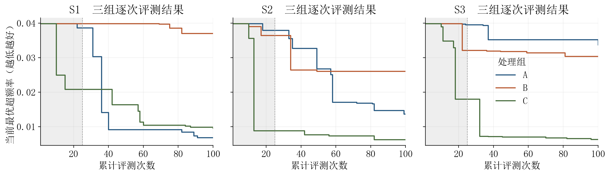
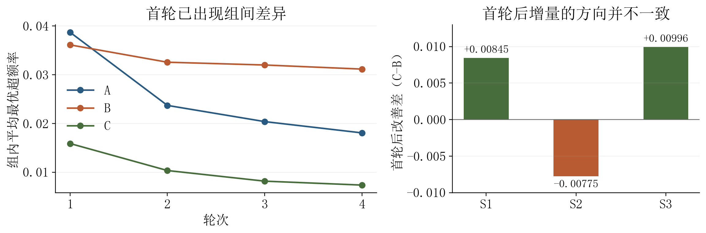
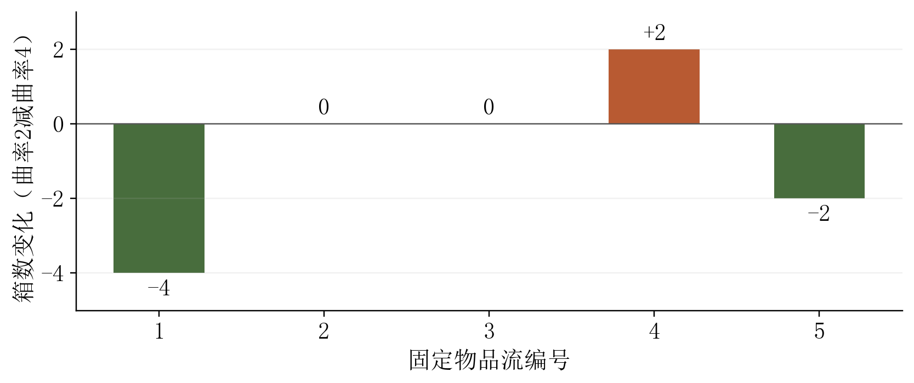

# 显式反思与在线经验积累对启发式搜索的影响

## 在线装箱问题的两阶段三组对照先导研究

## 摘要

为考察显式反思和运行内经验积累能否改善大语言模型驱动的启发式搜索，本文在历史605次实验所使用的在线装箱任务上，比较直接依据评测事实制定计划、先形成研究笔记再制定计划、以及进一步积累并复用本次运行经验三种研究流程。研究包括连续两批各三个配对种子的先导实验。第一批九次运行共使用900次评测，三组终点超额率均值分别为0.018077、0.031157和0.007378；在线经验组虽然较好，但其首轮已经领先，不能据此推断经验机制的净效应。第二批使每个配对中的三组共享完全相同的实际首轮，再各自完成75次评测。三组终点均值分别为0.009256、0.007948和0.016568，实际评测总量为750次。共同起点消除了第一批最明显的初始状态混淆，结果却未呈现稳定排序：显式反思仅在一对中优于直接计划，在线经验虽在两对中优于显式反思，但另一对明显较差，平均过程质量亦未改善。第三对中一组分析主体的模型条件无法证明与其余组等价，因而三对比较只能作探索性描述。研究笔记与经验的形成和使用可以追溯，具体候选也呈现可解释的局部变化；然而，三对样本、已暴露的训练实例和总体分析成本缺失均限制了效果推断。本文据此将共同起点后的结果视为对研究流程及其风险的诊断，而不宣称显式反思或经验积累具有稳定收益。

**关键词：** 在线装箱；启发式搜索；显式反思；在线经验；配对比较；先导实验

## 1 研究动机与本次实验的定位

历史605次多岛实验说明，大语言模型辅助的启发式搜索能够在固定问题实例上发现较优规则。但是，这批实验同时使用多岛探索、历史信息共享和不同搜索深度，无法据其终点结果区分各个组成部分的作用。本文进一步关注一个更具体的问题：当候选生成与评测条件尽量保持一致时，要求研究主体显式总结证据，或者允许其复用此前形成的经验，是否会改变后续搜索问题与结果。

这项研究包含两个层次。方法层面考察评测事实是否被转化为具有可检验内容的认识，以及这些认识是否影响下一轮计划。结果层面考察固定评测预算下的终点质量与整个搜索过程。前者成立并不自动意味着后者改善；即使某组得到较好的候选，也仍需判断这一优势是否产生于所考察的处理。

为避免混淆，表1区分历史基准、早期预诊断及本文先后完成的两批三组实验。

**表1 四批资料的研究定位**

| 批次 | 研究对象 | 规模 | 本文中的作用 |
|---|---|---|---|
| 历史多岛实验 | 旅行商、车辆路径、在线装箱 | 605次有效运行 | 历史探索水平与候选方法参照 |
| 早期三组预诊断 | 目标下界已被基准达到的简化装箱任务 | 9个运行 | 说明研究问题缺少改善余量时不能评价增益 |
| 首批三组先导实验 | 恢复的历史在线装箱任务 | 9个运行，900次评测尝试 | 分析流程内容，并识别首轮状态差异 |
| 共同首轮配对实验 | 同一在线装箱任务 | 3个共同首轮、9个后续分支，750次实际评测 | 在相同首轮状态后观察三组差异 |

早期预诊断中，基准目标已等于零，无法再通过目标下降区分处理；其研究问题与计划内容也未充分响应具体候选。因此，该批结果不并入本文的质量统计。后两批均使用具有实际改善余量的历史装箱任务，并对候选层面的观察与后续问题作了具体分析。

历史605次运行与两批新实验也不能直接合并为一个样本。它们的问题覆盖、搜索配置、历史信息条件和研究目的不同；两批新实验的首轮处理又不相同。本文承接历史任务的数学定义与候选参照，分别报告各批比较条件和观察结果。

## 2 问题定义与比较方法

### 2.1 在线装箱目标与评价实例

物品按顺序到达，每个物品必须立即分配至可容纳它的箱中，已作出的分配不再调整。箱容量为100，研究资料包含五条固定物品流，每条5000个物品。候选规则在已有箱与可启用的新箱之间作出选择，以最终使用箱数尽可能少为目标。

设第k条物品流的使用箱数为Bₖ，体积约束给出的整数下界为Lₖ，则总体超额率定义为

$$
E=\frac{\sum_{k=1}^{5}(B_k-L_k)}{\sum_{k=1}^{5}L_k}.
$$

五个下界依次为2012、1983、1978、1986和1980，平均下界为1987.8。该目标是平均箱数相对于平均下界的超额，不是单实例相对误差的简单平均，也不是相对于已知最优箱数的误差。E越小越好。

共同基准采用最佳适应规则，即选择能够容纳当前物品且剩余容量最小的箱。其五条流箱数为2094、2059、2057、2067和2058，对应超额率0.039843042560。该数值与历史报告冻结的0.0398接近，但身份不同：前者是本次明确评测的同一规则，后者是早期纯进化实验中位数的舍入参考，不能仅因数值接近而混用。

五条物品流都曾用于历史候选评价，属于已暴露的研究实例。本次没有使用新的独立测试实例，以下质量结论均限于这五条流。

### 2.2 三组处理及其估计对象

**表2 三种研究流程**

| 组别 | 制定下一轮计划的方式 | 研究笔记 | 历史经验来源 |
|---|---|---|---|
| A | 阅读当前事实及对比材料后直接制定计划 | 不要求额外完整笔记 | 不启用独立经验积累 |
| B | 先形成与证据对应的研究笔记，再据此制定计划 | 必须形成并用于后续计划 | 不启用独立经验积累 |
| C | 在B组流程上检索和使用较早轮次的经验 | 与B组相同 | 仅来自本次运行，从空白开始 |

A与B获得相同种类的事实、相同的材料选择规则和相同的信息字段；随着各自搜索结果不同，实际材料内容可以不同。B相对于A增加的是“强制形成并使用显式研究笔记”的流程，而不是从行为资料中不可观察的内部思考。A仍可以理解材料、作出判断，并在停滞后说明继续搜索的依据。

C相对于B增加运行内经验积累。各次运行均从空白经验开始，仅允许使用本次运行较早轮次形成的认识，不预置历史优良规则，也不共享其他组或其他种子的经验记录。没有可复用认识时不要求形成新经验。

各组使用共同的初始计划，处理差异在首轮评测结束后开始体现。因此，C与B的主要诊断区间为第二至第四轮。首轮虽然采用相同生成条件和搜索种子，仍可能获得不同候选，这一点是后文解释结果的关键。

### 2.3 预算与重复设置

本节至第8节报告首批三组实验。共同首轮配对实验采用相同的数学目标，但其首轮共享方式与样本编号另见第9节，两批统计不合并。

实验设置三个搜索种子，分别记为S1、S2和S3，对应1836735484、1706957291和3122620597。每个种子下分别开展A、B、C三种处理，共九个运行。候选生成模型均为DeepSeek V4.1 Flash，初始搜索计划与主要搜索参数保持一致。

每运行固定100次评测尝试，分为四轮，每轮25次。评测次数是主比较中唯一保持相等的资源；反思与经验处理可能带来的额外模型消耗另行报告。重复基准评价、已有候选重评以及中断尝试均占用预算，不能只统计留下有效结果的候选。

本批每运行实际包含84次生成候选的评测尝试、4次基准评价和12次既有候选重评。九个运行全部达到100次预算，无主动提前停止。两个生成尝试中断后未留下完整候选结果，仍占用相应评测位置。预算结束后不追加搜索以改善不理想成绩。

“配对”表示相同搜索种子下的三组被对应比较，并不保证模型生成的候选、初始种群或第一轮结果相同。该设计也没有形成信息完全隔离的独立决策主体，因此本文不将配对编号视为已经满足随机因果比较的充分条件。

### 2.4 质量与过程指标

设某个运行在第t次评测后已知的最优目标为fₜ，固定预算终点为f₁₀₀。以累计最优目标之和衡量搜索过程：

$$
Q=\sum_{t=1}^{100}f_t.
$$

Q越小，表示在更多评测位置上较早获得低目标值。Q未除以100，其除以100后的值为平均过程目标。中断尝试沿用此前最优值，但仍保留预算位置。共同基准已提供有限的初始参照，不以缺失值或零替代尚未改善的结果。

同时记录每轮终点、有效生成比例、行为重复比例及逐实例箱数。有效生成比例以生成尝试为分母；行为重复比例以具有可比较行为的候选为分母。行为不同只用于判断搜索是否产生新的决策过程，不单独等同于质量提高。

本研究只有三对运行，均值、样本标准差和配对差均作为描述量，不进行显著性检验，也不据此承诺精确的正式样本量。

## 3 固定预算下的总体结果

### 3.1 九个运行的逐轮结果

**表3 各轮最优超额率**

| 配对 | 组别 | 第1轮 | 第2轮 | 第3轮 | 第4轮终点 |
|---|---|---:|---:|---:|---:|
| S1 | A | 0.038636 | 0.009156 | 0.009156 | 0.006842 |
| S1 | B | 0.039843 | 0.039843 | 0.038535 | 0.037026 |
| S1 | C | 0.020827 | 0.016400 | 0.010464 | 0.009558 |
| S2 | A | 0.037931 | 0.026763 | 0.016802 | 0.013683 |
| S2 | B | 0.036422 | 0.026059 | 0.026059 | 0.026059 |
| S2 | C | 0.008854 | 0.007647 | 0.007345 | 0.006238 |
| S3 | A | 0.039541 | 0.035215 | 0.035215 | 0.033706 |
| S3 | B | 0.032096 | 0.031794 | 0.031391 | 0.030385 |
| S3 | C | 0.018010 | 0.007043 | 0.006741 | 0.006339 |

按目标由低至高排列，S1为A、C、B，S2为C、A、B，S3为C、B、A，说明不存在三组在所有种子上完全一致的全序关系。C在三个配对中均优于B，在两个配对中优于A；B只有在S3中优于A。

A在S1的第二轮发生较大改善，从0.038636降至0.009156，最终达到0.006842。B在S2第二轮改善后，后两轮保持0.026059。C在S2首轮就达到0.008854，随后逐步降低至0.006238。这些差异说明，最终排名不能替代对改善发生时点的分析。

图1灰色区域表示第1至第25次评测，即处理差异正式开始前的首轮。该区域内三条曲线已经分化；灰色区域代表共同的初始生成规则，不代表已经实现相同的初始搜索状态。

### 3.2 组内分布与平均过程表现

**表4 三组结果的描述性汇总**

| 组别 | 终点均值 | 终点中位数 | 终点样本标准差 | 平均累计目标Q | 首轮后平均改善 |
|---|---:|---:|---:|---:|---:|
| A | 0.018077 | 0.013683 | 0.013960 | 2.766509 | 0.020626 |
| B | 0.031157 | 0.030385 | 0.005524 | 3.413489 | 0.004964 |
| C | 0.007378 | 0.006339 | 0.001889 | 1.417346 | 0.008519 |

C的终点均值、中位数和平均累计目标均最低；在本组三个观察值中，其离散程度也较小。A的终点波动最大，既包含0.006842的较优结果，也包含0.033706的较弱结果。B的波动相对较小，但终点集中在较高目标区间。因此，较小的离散程度本身不能解释为较好的算法表现。

相对于共同最佳适应规则，A、B、C终点均值对应的超额率下降分别为54.63%、21.80%和81.48%。这些比例描述各组相对于一个固定规则的训练成绩，不是反思或经验处理的净效应；也不能改写为箱数减少相同比例。

三组首轮之后的平均改善分别为0.020626、0.004964和0.008519。A的后续平均改善反而最大。该现象与C终点最好可以同时成立：终点水平取决于首轮起点与后续变化，起点更低的运行也具有不同的剩余改善空间。

### 3.3 与605次历史基准的联系

历史605次实验中最优装箱规则在相同五条流上重新校准后，超额率为0.006741120837。本次C在S2和S3的终点分别为0.006238052118与0.006338665862，均低于该历史候选；C在S1的终点仍高于它，C组终点均值0.007378也高于它。

在相同体积下界下，S2和S3相对于历史候选的平均箱数分别减少约1个和0.8个，即五条流合计减少5个和4个箱。这表明本次搜索发现了能够继续改善历史候选成绩的规则，但改善属于固定研究实例上的候选结果。

历史最优值来自605次运行后的选择，本次最优值来自九个运行后的选择；搜索投入和信息条件不同。两者可以作为历史水平对照，不能用来证明本次研究流程具有更高的单位预算效率。某一新候选达到与历史候选相近的目标值，也不能据此认定二者使用相同的决策规则。

## 4 首轮差异与处理效应的解释

### 4.1 首轮并未实现相同搜索状态

A、B、C首轮目标均值分别为0.038703、0.036120和0.015897。此时各组尚未因显式研究笔记而改变后续计划，C也尚未从先前轮次读取经验，但其首轮表现已经明显更好。

因此，相同计划、相同参数和相同搜索种子只统一了部分生成条件，未固定所有生成随机性。把C的终点领先完全解释为经验复用，会将处理开始之前的差异错误归入处理效果。增加相同设计的重复次数或对终点值作更复杂的显著性检验，都不能直接消除这一解释问题。

### 4.2 首轮水平与后续改善的恒等分解

记组g在配对s中第r轮的最优目标为$F_{s,g,r}$，并定义首轮之后的改善量

$$
G_{s,g}=F_{s,g,1}-F_{s,g,4}.
$$

C相对于B的终点优势可以分解为

$$
F_{s,B,4}-F_{s,C,4}
=\left(F_{s,B,1}-F_{s,C,1}\right)
+\left(G_{s,C}-G_{s,B}\right).
$$

该式只是两个观察轨迹的算术恒等式，不需要因果假设，也不提供因果识别。对三个配对取平均，C相对B的终点优势0.023778可写为首轮优势0.020223与后续增量差0.003555之和。按这项恒等分解，首轮差距占终点差距约85.05%。

这里的85.05%不能表述为“初始随机性解释了85.05%的因果效应”，其余14.95%也不能表述为“记忆的净贡献”。后续改善仍可能受初始规则形态、剩余改进空间、生成随机性和跨运行信息影响。

**表5 配对差异与首轮后变化**

| 配对 | B−A终点差 | C−B首轮差 | C−B终点差 | C的后续改善−B的后续改善 |
|---|---:|---:|---:|---:|
| S1 | +0.030184 | −0.019016 | −0.027468 | +0.008452 |
| S2 | +0.012375 | −0.027568 | −0.019821 | −0.007747 |
| S3 | −0.003320 | −0.014086 | −0.024047 | +0.009961 |

表5前三项以目标较低为优，最后一项以改善较大为优。S2中，C虽然终点明显优于B，但首轮之后的改善小于B；S1和S3则观察到C在首轮之后改善更多。三个配对的后续增量方向并不一致。

B与A的比较同样需要谨慎。B在S3终点优于A，但它在首轮已经领先；三个配对中，B的首轮后改善均小于A。这使本批结果无法支持“强制反思稳定提高搜索质量”的判断，却也不能证明反思普遍有害，因为三组并未从相同实际状态出发，且比较次数很少。

### 4.3 信息隔离不足的限制

C的显式经验记录仅来自本次运行，未混入其他种子或其他组的经验；但负责分析与计划的同一决策主体曾跨运行阅读各组资料。因此，显式经验来源的隔离不等于全部可用知识的隔离。

在这种条件下，某组后续问题可能受到其他运行中已见结构的间接影响。本次资料无法量化这种影响，也不能凭未发生显式跨组经验读取而认定它不存在。后续实验应在信息来源层面形成独立条件，而不只是分别保存经验记录。

## 5 反思与经验复用的具体内容

### 5.1 从现象总结转向可检验问题

本次研究笔记不再仅复述“当前结果较好”或“继续优化”。反思内容涉及评分符号与实际选择方向是否一致、不同表达是否产生相同排序、固定公式中某个参数的局部变化，以及总体改善是否掩盖个别实例退化。

例如，部分候选声称偏好较满的箱，但其评分却随剩余容量增大而增加。在选择最高评分的条件下，这一项可能偏好空间较大的箱。研究笔记据此提出检查评分方向的问题，而不直接接受规则名称或文字说明。另一些不同表达在所有可比较决策中给出同样选择，说明表达变化未必引起行为变化。

这些例子表明，本次显式反思能够提出指向具体候选的机制问题。然而，形成合理问题与提高最终目标是不同结果。B在S2提出了有关周期项和余量排序的区分问题，后两轮目标仍未改善。报告保留这类未产生收益的观察，避免只展示成功的反思案例。

### 5.2 经验内容的适用条件

C共形成5条可复用经验，九个后续轮次均实际使用了本次运行较早形成的经验。经验内容不只是保存某个目标值，而是包括“检查最大评分选择下的符号方向”“在准确保留现有公式时做局部对比”“总体改善需同时查看各物品流”等研究原则，以及范围明确的局部参数认识。

S1中，同一评分骨架下的不对称系数由0.85增至0.9、再增至1.0，对应目标依次下降。后续研究据此继续考察附近参数，但未把局部趋势扩展为任意增大参数都有效。S3中，一个加法评分形式的中部残差权重1.5优于0.75；当后来换成乘法或倒数结构时，没有把这一系数结论直接移植过去。

S2的早期经验针对一种高斯形状评分。后续候选改变主要形状后，仍可保留“固定完整公式做局部比较”的研究原则，却不能继续把旧公式的局部参数建议视为新公式上的结论。适用条件的收缩与保留本身是经验使用的重要内容。

以上证据支持“经验被形成并实际参与后续计划”，不能直接证明“由于使用该经验，搜索结果才更好”。经验是否提供了近期反馈之外的新增价值，还需要与等量近期事实等对照条件比较。

### 5.3 一个可解释的局部曲率变化

S3的C组第四轮提供了一个较清楚的局部对比。设当前物品尺寸为a，候选箱放置前剩余容量为b，放置后残差为r=b−a。中部残差偏好采用有界倒数形状：

$$
\phi_\kappa(r)=\frac{1}{1+\kappa(r/100-1/2)^2}.
$$

令δ(r,a)表示r与非负整数倍物品尺寸之间的最小距离，相应的对齐奖励为

$$
A(r,a)=\frac{1}{1+\delta(r,a)/\max(a,1)}.
$$

完整局部评分可写为

$$
S_\kappa=\left[2\phi_\kappa(r)+A(r,a)+3\,\mathbf{1}_{\{r=0\}}\right]
\left[1-0.05\,\mathbf{1}_{\{b=100\}}\right].
$$

其中，第一项偏好适度的残差空间，对齐项偏好接近物品尺寸整数倍的空间，恰好装满获得额外奖励，新箱受到轻微折扣。在两个相比较的候选中，其他项保持不变，仅将κ从4改为2。

对固定r，κ减小会提高偏离50时的形状值，而在r=50处保持为1。因此，该调整使中部偏好的下降更平缓。它改变的是整个评分中的一项，不能简单解释为所有状态下都更偏好某一个固定箱。

**表6 曲率调整前后的逐实例箱数**

| 物品流 | κ=4 | κ=2 | 箱数变化 |
|---|---:|---:|---:|
| 1 | 2030 | 2026 | −4 |
| 2 | 1993 | 1993 | 0 |
| 3 | 1993 | 1993 | 0 |
| 4 | 1997 | 1999 | +2 |
| 5 | 1993 | 1991 | −2 |
| 合计 | 10006 | 10002 | −4 |

对应超额率由0.006741120837降至0.006338665862，减少0.000402454975；平均箱数减少0.8个。两个实例改善、两个不变、一个退化，说明总体下降并不等价于各实例同时受益。

在相同固定物品流和其余评分项不变的条件下，可以将这个局部结果归于此次参数替换对决策过程的影响。但它没有证明κ=2在未见数据上更优，也没有证明提出这项对比必须依赖经验机制。规则参数的局部作用与研究流程的总体因果作用是两个不同问题。

### 5.4 广泛改写与局部解释的边界

若下一轮计划要求只改变一个参数，而候选同时改变形状函数、权重、恰好装满奖励和新箱处理，则最终目标即使降低，也不能把全部改善归给原先指定的单项变化。本次多个较优候选属于这种广泛改写。

例如，S3的B组曾围绕形状宽度开展研究，但最终较优候选改为另一种相乘的评分形式；S1的C组最终较优候选也改变了指数项。因此，本文将合法发现的较优规则保留为搜索结果，同时仅对实际保持其他条件不变的局部候选作单因素解释。

该区分也影响后续设计。若为了严格执行局部计划而拒绝广泛改写的候选，就同时改变了搜索空间与资源分配方式。这可以成为新的实验条件，但不能据此重新解释已经完成的本次结果。

## 6 搜索有效性与成本

**表7 候选状态与已知成本**

| 组别 | 有效生成数／尝试数 | 有效率 | 重复数／可比较数 | 平均生成模型词元 | 平均搜索阶段秒数 |
|---|---:|---:|---:|---:|---:|
| A | 241／252 | 95.63% | 112／241 | 319121 | 717.12 |
| B | 244／252 | 96.83% | 132／244 | 310432 | 576.41 |
| C | 238／252 | 94.44% | 110／238 | 358758 | 685.65 |

B的有效生成比例最高，但平均终点质量最差；C的有效比例略低，终点质量却较好。因此，可评价候选比例衡量搜索的可用产出，不直接衡量最终解质量。

A、B、C的行为重复比例分别为46.47%、54.10%和46.22%。B较高的重复比例与其较小的后续改善同时出现，但该共同变化不足以识别因果方向。不同形式可能产生相同排序，行为差异也可能只带来较差选择，故不能把重复较少单独解释为算法质量提高。

九个运行共发出815次候选生成请求，已记录的候选生成模型输入与输出合计2964934个词元。词元是模型处理和生成文本的计量单位。C的平均生成词元比B高约15.57%，表明本次更好的训练结果并非在所有资源维度上保持相同投入。

外层分析与计划所消耗的精确词元和可归属时间不可得，因此总模型消耗与完整研究耗时均未知。未知值不能按零计入。表7的时间仅表示各运行搜索阶段的累计耗时；九个运行耗时之和5937.54秒也不是整个批次的端到端时间。本文据此不宣称C具有总体成本优势，也不以生成词元代替总模型成本。

## 7 结论边界与后续研究

### 7.1 本阶段能够支持的结论

本次九个运行在统一评测次数下完成了对三种研究流程的先导比较。C取得最低终点均值，并在三个配对中均优于B；B相对于A未表现出一致的终点优势。该结果构成继续研究的质量信号，但尚不能形成处理有效性的确认性结论。

从研究内容看，显式反思已能够围绕真实候选提出有区别的机制问题，经验积累也体现了适用条件和不确定性。局部曲率对比进一步说明，部分问题可以被转化为数学上明确的参数变化，并观察到可解释的实例差异。

这批材料在论文中的主要价值，是连接历史候选发现与后续机制验证：既保留了较好的搜索结果，也揭示了为何首轮状态、信息隔离和实际改动范围会影响结论。

### 7.2 尚不能支持的结论

本次不能证明强制反思稳定优于直接计划，不能证明在线经验导致了C组的全部或部分终点优势，也不能证明该优势在未知物品分布上成立。C在处理开始之前已经领先，不能通过终点排名补足因果依据。

九个运行只有三个配对单位，五条物品流又共同参与候选选择。不能把九个运行与五个实例相乘，视为45个独立处理重复；也不能把24条内容不同的假设视为24次有效机制验证。

首轮后的差值调整属于补充描述，不消除初始状态差异和跨运行信息影响。完整成本缺失则使“相同总投入下更优”的判断同样缺乏依据。

### 7.3 后续优先改进的实验设计

下一阶段首先应让每个配对下的三组从同一实际首轮状态出发，包括相同的候选集合、评价事实和当前最优规则，再分别施加三种处理。共同首轮与后续分支如何计入总评测预算，应在实验前明确。这样才能把第二至第四轮的比较更直接地对应于处理差异。

其次，应为三组提供相互隔离的分析语境，防止未明示的跨组知识进入。C仍从空白经验开始，仅积累该分支处理后形成的认识；A与B仍使用同一种材料构造方法。

再次，应区分实际单因素候选与广泛改写候选，分别讨论局部机制与整体搜索质量。关于经验价值，可增加内容长度相近的近期事实对照，以区分可复用认识与额外信息量的作用。

在这些条件明确后，再以最小有意义的质量改善、预算和新的方差估计确定正式样本量。候选选择与停止规则应先于最终独立评测固定，不能根据独立测试结果返回调整。上述共同起点与信息隔离的设计后来用于第二批诊断，结果见第9节。内容长度相近的经验对照和独立评测仍属后续研究问题。

## 8 首批实验小结

首批实验在历史在线装箱任务上完成了三组、三个配对种子、共900次评测尝试的先导分析。直接计划、显式反思和反思加在线经验三组的终点超额率均值依次为0.018077、0.031157和0.007378。C组表现出较好的训练质量，但其首轮已存在明显优势；B组也未显示稳定优于A组的结果。因此，终点排名不能直接转换为反思或经验积累的因果结论。

这批材料更明确地展示了由具体候选事实形成研究问题、限定经验适用条件以及检验局部参数变化的过程。首轮状态差异促使研究进一步采用共同实际起点开展对照，以缩小解释上的不确定性。

## 9 共同首轮配对实验

### 9.1 共同起点与预算计量

为消除首批实验中处理开始之前的组间差异，第二批对每个搜索种子只进行一次25次评测的共同首轮。随后将同一候选集合、逐实例结果、当前最优规则和比较材料分别作为A、B、C三组的起点。每组再完成三轮、每轮25次评测，形成各有100个位置的质量轨迹。三个配对种子记为T1、T2和T3，与首批S1至S3不同；各配对的共同首轮实际最优超额率分别为0.035315、0.038133和0.022336。

本批实际评测数为3×(25+3×75)=750。若按三组各自的100个位置记录，则共有900个预算位置，其中150个位置对应被三组共同使用的首轮事实，不能解释为新增评测。每个配对内部的首轮候选与评价结果一致；各组处理从首轮结束后开始。A与B获得相同结构和选择规则的材料，C从空白经验开始，只能使用本分支较早轮次的记录。观察区间因此主要为第26至100次评测。

记第t次评测后的最优超额率为fₜ。第二至第四轮的过程指标定义为第26至100次的fₜ之和，记为Q₂₆:₁₀₀；它越低，表示处理开始后较早取得并保持较低目标。本批依旧只在相同评测次数下比较，不将分析主体的文字处理成本视为相同。

### 9.2 终点与过程结果

**表8 共同首轮后各分支的逐轮最优超额率**

| 配对 | 组别 | 共同首轮 | 第2轮 | 第3轮 | 第4轮终点 | 后三轮累计目标 |
|---|---|---:|---:|---:|---:|---:|
| T1 | A | 0.035315 | 0.010363 | 0.009156 | 0.007546 | 1.161284 |
| T1 | B | 0.035315 | 0.008452 | 0.008049 | 0.008049 | 0.885300 |
| T1 | C | 0.035315 | 0.008150 | 0.006641 | 0.006339 | 0.966898 |
| T2 | A | 0.038133 | 0.032498 | 0.007043 | 0.006842 | 1.553778 |
| T2 | B | 0.038133 | 0.033806 | 0.033806 | 0.008150 | 2.248315 |
| T2 | C | 0.038133 | 0.038032 | 0.037227 | 0.037227 | 2.822920 |
| T3 | A | 0.022336 | 0.018312 | 0.013382 | 0.013382 | 1.304658 |
| T3 | B | 0.022336 | 0.021229 | 0.008049 | 0.007647 | 1.053627 |
| T3 | C | 0.022336 | 0.009961 | 0.006641 | 0.006137 | 0.753496 |

表8显示，相同首轮并未带来统一的处理排序。T1的B组较A组更早取得较低目标，故其后三轮累计目标较小，但A在终点略优于B；C在终点优于B，过程指标却略大。T2中A在第三轮明显改善，B直到第四轮才获得接近的结果，C则在后三轮一直未能摆脱相对较高的超额率。T3中C在第二轮即有明显改善，B在第三轮改善，A的终点仍较高。仅观察终点会遗漏改善发生的时点，反之也不能用某一段过程优势代替终点结论。

**表9 共同首轮实验的组内描述量**

| 组别 | 终点均值 | 终点中位数 | 后三轮累计目标均值 | 有效生成数／尝试数 | 行为重复数／可比较数 |
|---|---:|---:|---:|---:|---:|
| A | 0.009256 | 0.007546 | 1.339907 | 234／252 | 82／234 |
| B | 0.007948 | 0.008049 | 1.395747 | 234／252 | 106／234 |
| C | 0.016568 | 0.006339 | 1.514438 | 229／252 | 98／229 |

B的终点均值低于A，但后三轮累计目标均值反而较高，二者分别反映预算终点和改善速度。C的终点均值受T2较差结果影响而高于另外两组，其终点中位数却最低。三个观测值下，均值与中位数差异提示结果受单个配对影响较大，不能用一项组内平均值概括处理的稳定作用。A、B、C的有效生成比例依次为92.86%、92.86%和90.87%；行为重复比例依次为35.04%、45.30%和42.79%。这些比例描述候选的可评价性及搜索覆盖，不构成质量增益的独立证据。

**表10 共同首轮实验的终点配对差**

| 配对 | B减A | C减B | B优于A | C优于B |
|---|---:|---:|---|---|
| T1 | 0.000503 | -0.001710 | 否 | 是 |
| T2 | 0.001308 | 0.029077 | 否 | 否 |
| T3 | -0.005735 | -0.001509 | 是 | 是 |
| 三对均值 | -0.001308 | 0.008619 | 1／3 | 2／3 |

表10中负差表示后列处理取得更低的终点超额率。实验前将“至少两对终点方向一致且平均改善达到0.0005”设为是否值得扩样的描述性门槛。B相对于A仅有一对改善；C相对于B虽有两对改善，平均差却为正，故两项比较均未达到这个门槛。更重要的是，T3的B组分析主体使用的模型条件无法与其他组逐项核对，三对汇总不满足事先规定的严格处理比较条件。仅看前两对处于相同分析环境的描述性结果，B在两对终点均不优于A，C相对B一优一劣；样本更小，仍不能据此进行正式效果推断。

### 9.3 研究内容与经验使用的解释

第二批的认识链可以沿各轮评价事实、对比材料、研究笔记、下一轮计划和实际候选顺序追溯。B、C在后续轮次形成的计划均可追溯到前一轮笔记；C所读取的经验来自本分支较早轮次，空白起点和后续阅读均得到核对。由此可以确认研究流程确实发生，而不是仅以组别标签代替处理。然而，记录证明经验被提供和阅读，并不证明经验带来了新的有效知识，更不证明它改善了目标。

T2尤能说明这一点。C组的经验进入后续决策，但计划持续围绕较弱的当前规则调整局部评分，直到预算终点仍为0.037227；同一首轮出发的A组转向其他剩余空间评分形式，第三轮降至0.007043，终点为0.006842。B组在第四轮也降至0.008150。C的持续低效与“早期经验可能使搜索局限于当前规则附近”的解释相容，但本实验未单独改变经验内容或检索方式，不能判定经验是造成该结果的原因。

T3呈现相反的描述：C第二轮已降至0.009961，终点达到0.006137；B在第三轮才明显改善，终点为0.007647。不过，B获得改善的候选采用了较广泛的评分形式变化，超出了狭义局部调整，不能把全部下降归于笔记中某个单一机制。结合T1和T2，第二批支持的是“相同起点下不同研究过程可能对应不同搜索路径”，尚不足以确定哪一种过程通常更优。

### 9.4 成本与推断范围

后三轮的评测预算在各分支完全相同，但文字分析与经验处理的总词元不可完整取得。本批已知的候选生成模型词元在A、B、C组每分支平均约为332583、327348和362035；C的该项投入较高，而研究主体本身的词元缺失，因此不能比较完整模型成本或总词元效率。不同分支的运行时段还受到并行安排与中断影响，不宜据墙钟时间作处理优劣排序。

第二批修复了首批“相同随机编号却不共享实际首轮”的主要问题，但只有三个配对。T3中一组分析主体的模型条件不等价风险又影响了完整配对汇总；即使去除这一对，剩余两对也不足以估计稳定效应。五条物品流均属于已经用于候选选择的训练资料，不能检验未见实例上的泛化。因而，表8至表10应解释为训练条件下的诊断结果，不作显著性结论或独立测试表现的推断。

## 10 综合结论

两批三组研究呈现同一问题的两个层次。首批结果说明，终点领先可能主要来自处理开始前的首轮差异；第二批通过共同实际首轮消除了这一混淆，但没有出现跨配对稳定的终点与过程优势。具体候选分析证明，反思可以形成可检验的问题，经验能够进入下一轮决策；这两项机制层面的事实与“当前未观察到稳定质量收益”并不矛盾。

下一步应首先固定可核对的分析主体模型条件与完整成本记录，再研究笔记究竟何时提出了区别于当前事实的可执行问题，以及经验复用何时促进探索、何时可能使搜索围绕早期规则收缩。可将经验内容与信息量相近的近期事实作对照，并预先规定局部机制候选和广泛改写候选的解释边界。只有在这些条件下获得足够的重复与明确质量信号，才适宜确定正式样本量；独立测试仍应在选择规则冻结后单独进行。

## 资料说明

首批和第二批分别完成900次与750次实际评测，均只使用已暴露的训练资料；两批分别统计。正文数值按六位小数展示，原始记录保留完整精度。
